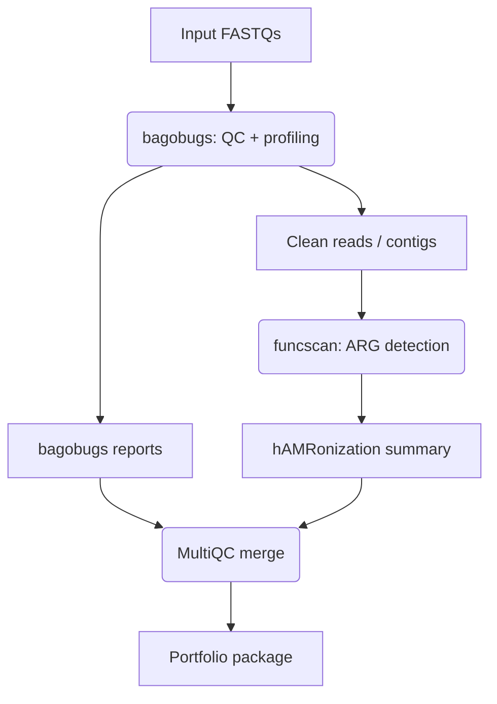

# Design: Shotgun Metagenomics Pipeline

## 워크플로우 다이어그램 (Mermaid Workflow Diagram)

## 컨테이너 레이어 (Container Layers)
- 파이프라인은 Nextflow를 사용하여 오케스트레이션됩니다.
- 모든 소프트웨어 종속성은 컨테이너를 통해 관리됩니다.
- 지원되는 컨테이너 엔진:
    - **Docker**: 로컬 실행 및 테스트에 사용됩니다.
    - **Singularity**: HPC 환경 (예: SLURM)에서 사용됩니다 (`-profile singularity`).
- nf-core 파이프라인(`bagobugs`, `funcscan`)은 필요한 모든 도구 (MetaPhlAn, HUMAnN, RGI, ABRicate, MultiQC 등)가 포함된 자체 컨테이너 이미지를 제공합니다.
- Nextflow는 실행 환경에 따라 적절한 컨테이너를 자동으로 가져오고 사용합니다.

## 데이터 경로 (Data Paths)

- **입력 (Input)**:
    - `samplesheet.csv`: 샘플 정보 및 FASTQ 파일 경로를 지정합니다. 형식은 nf-core 표준을 따릅니다.
    - 또는, `-profile test` 사용 시 데모 FASTQ 파일이 자동으로 다운로드 및 사용됩니다.
- **중간 파일 (Intermediate Files)**:
    - Nextflow `work/` 디렉토리: 각 프로세스의 중간 결과가 저장됩니다. 디버깅에 유용하지만 최종 결과는 아닙니다.
    - `nf-core/bagobugs` 출력: QC된 FASTQ, 분류학적/기능적 프로파일 결과, 개별 보고서 등.
    - `nf-core/funcscan` 출력: ARG 검출 결과.
- **출력 (Output)**:
    - `results/` 디렉토리 (기본 Nextflow 출력 디렉토리):
        - `multiqc/`: `multiqc_report.html` 및 관련 데이터 포함.
        - `bagobugs/`:
            - `krona/`: 각 샘플의 `*_krona.html` 파일.
            - `humann/`: HUMAnN TSV 출력 파일.
            - 기타 bagobugs 결과...
        - `funcscan/`:
            - `hamronization/`: `hamronization_summary.html` 및 관련 파일.
            - 개별 ARG 도구 결과 (RGI, ABRicate)...
        - `pipeline_info/`: 실행된 파이프라인 및 소프트웨어 버전 정보 (`software_versions.yml` 등). 